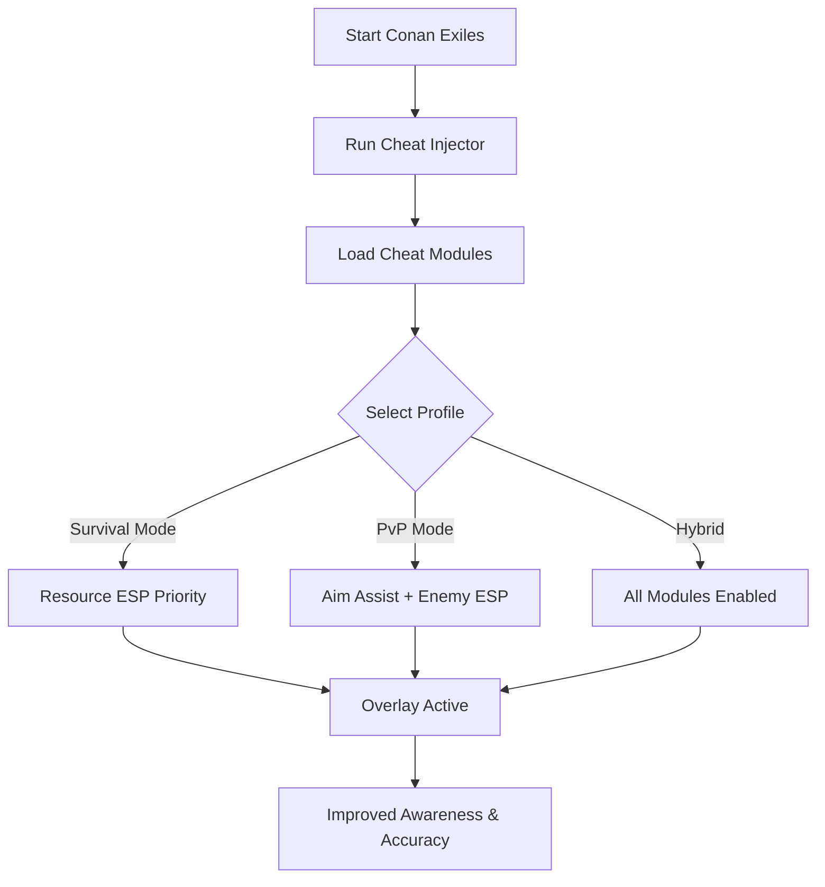

# Conan Exiles Cheat Tool ⚔️

Survival in **Conan Exiles** is brutal—dangerous wildlife, hostile players, and harsh environments test you constantly. To thrive, you need awareness and precision. The **Conan Exiles Cheat Tool** offers just that, with **ESP overlays, aim assist, and resource tracking modules** tailored for PC players.

---

## 🌐 Overview

Unlike basic cheat engines, this tool is **modular and adaptive**. Switch between survival-focused resource ESP, combat aim assist, or hybrid configs on the fly. It’s lightweight, customizable, and hotkey-ready for any scenario, whether you’re farming resources, raiding, or defending your base.

---

## 🔑 Features

* 👁 **ESP Overlay** – Highlights enemies, allies, loot, and rare resources.
* 🎯 **Configurable Aim Assist** – Adjustable FOV, smoothness, and bone targeting.
* 💎 **Resource ESP** – Instantly spot ore, herbs, and crafting supplies.
* ⚡ **Recoil Manager** – Reduces ranged weapon kick for accuracy.
* 🗂 **Profile Manager** – Save farming, raiding, or PvP configs.
* ⌨️ **Hotkey Switching** – Instantly enable/disable features.
* 🔒 **Stealth Injection** – Secure loader with minimized detection risk.

---

[](#)
[](#)
[](#)
[](#)

---

## 🖥 Compatibility

| Platform       | Status        | Notes              |
| -------------- | ------------- | ------------------ |
| Windows 10     | ✅ Supported   | Stable performance |
| Windows 11     | ✅ Optimized   | Smooth overlays    |
| Linux (Proton) | ⚠️ Partial    | ESP only           |
| macOS          | ❌ Unsupported | VM-only workaround |

\[!NOTE]
ESP and aim assist are **optimized for Windows builds**.

---

## ⚙️ Setup Guide

1. Download the Conan Exiles Cheat package.

2. Extract the files into a secure folder.

3. Launch Conan Exiles.

4. Run the injector with administrator rights:

   ```bash
   conan_cheat.exe -game conanexiles.exe -mode stealth
   ```

5. Edit your `config.ini`:

   ```ini
   [Aimbot]
   FOV=85
   Smoothness=6
   Target=Chest
   Hotkey=Mouse5

   [ESP]
   Enemies=True
   Allies=True
   Resources=True
   EnemyColor=Red
   AllyColor=Blue
   ResourceColor=Green
   ```

6. Toggle the overlay with `Insert`.

\[!IMPORTANT]
Inject **after the game launches** to prevent crashes or errors.

---

## 📊 Cheat Workflow



---

## 🎚 Example Configurations

**Survival Farming:**

```ini
Enemies=False
Resources=True
Loot=True
```

**PvP Combat:**

```ini
Enemies=True
Smoothness=7
FOV=90
Target=Head
```

**Hybrid Profile:**

```ini
Enemies=True
Resources=True
Allies=True
Loot=True
```

\[!WARNING]
Running too many ESP elements at once may clutter your vision—focus configs are best.

---

## ❓ FAQ

**Q: Does this tool lower FPS?**
A: No, it’s lightweight with <3% performance impact.

**Q: Can I swap configs mid-game?**
A: Yes, hotkeys allow instant switching.

**Q: Does it work with controllers?**
A: Limited—optimized for mouse/keyboard.

**Q: Are updates frequent?**
A: Yes, updates track Conan Exiles patches.

**Q: Is stealth injection undetectable?**
A: It lowers risk but isn’t 100% safe online.

---

## 🚀 Final Thoughts

The **Conan Exiles Cheat Tool** blends **ESP overlays, aim assist, and resource tracking** into one complete package. Whether farming, raiding, or clashing in PvP, it delivers awareness and accuracy to stay ahead of the competition.

[](#)
[](#)
[](#)

---
